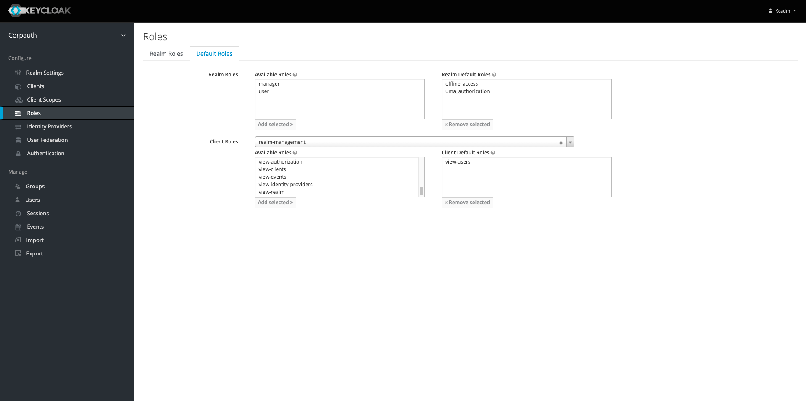
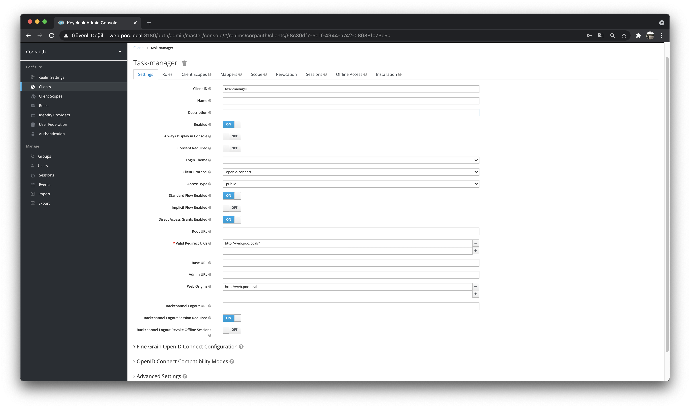

# Task Management App

This project is an event driven task management application that comprises of PostgreSQL DB and ReactJS, Apache Kafka, Kafka Streams (based on single writer principle) and the major ecosystem components like SchemaRegistry, Kafka Connect.

The UI is based on ReactJS and Bootstrap.

Keycloak with OpenLDAP is used as IdP (Identity Provider) to enable OAuth2 and OIDC driven AAA (AuthN, AuthZ, Accounting).

The Kafka Stream source, processor and sink implementations are based on Spring Cloud Stream Kafka Binder.

## Basic Setup
As this is a PoC project a local domain is used for Traefik edge router. Following entries should be entered for web and identity provider access in `/etc/hosts`:
```
127.0.0.1 web.poc.local
127.0.0.1 idp.poc.local
```

## Components
The project is shipped with of two different deployment modes as [fully containerized deployment](./docker/compose/docker-compose.containerized.yml) and [hybrid deployment](docker/compose/docker-compose.dev.yml):

* ***Fully Containerized:*** All of the components including SpringBoot based microservices are containerized. Can 
  be [started](docker/compose/cont-up.sh) and [stopped](docker/compose/cont-down.sh) using shell scripts.
* ***Hybrid Mode:*** All of the components **except** SpringBoot based microservices are containerized. Can be used 
  for development and be [started](docker/compose/dev-up.sh) and [stopped](docker/compose/dev-down.sh) using shell 
  scripts.

Here are the components:

### Web UI
ReactJS based Web UI to provide basic portal to manage tasks. React Hook and Context API are also used for state management:


### Messaging Layer
Event Driven messaging layer using Apache Kafka Ecosystem Tooling:
* Zookeeper
* Kafka Brokers
* Schema Registry
* Kafka Connect
* Rest Proxy
* Kafka Monitoring Stack

### Persistent Data Store
PostgreSQL RDBMS to persist event data on user and task topics for viewing on UI. PgAdmin is also available for DB administration.

### Monitoring Stack
Prometheus and Grafana based monitoring stack is available to view status of Kafka brokers:


### Identity Provider for OAuth2 & OIDC
Keycloak Identity Provider for OAuth2 & OIDC based AAA enablement. The IdP is backed by an OpenLDAP instance which is initiated by a designated [user database](./docker/compose/ldap/config/bootstrap.ldif).


The task user list on Add User screen is retrieved via Keycloak REST API that is populated from LDAP. To enable this 
functionality Keycloak admin should assign `view-users` role of `realm-management` client to realm:


<p float="center">
  
  
  
  
</p>

## ksqlDB
There exists a [documentation](./docker/compose/kafka/ksql/README.md) on ksql statements used in this projects.
